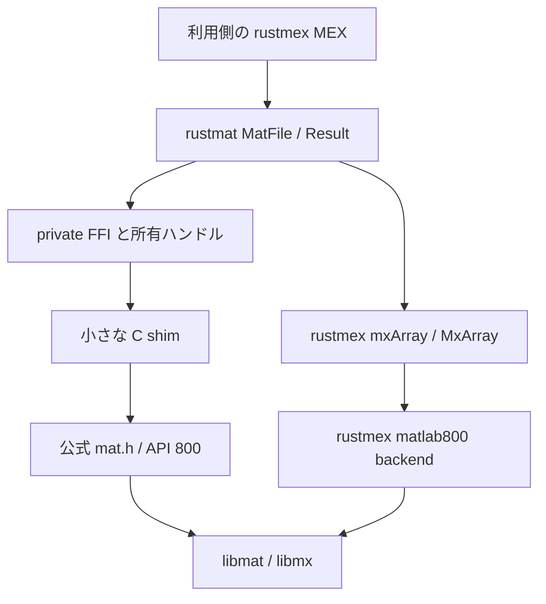

# rustmat 調査結果・設計方針・実装計画

調査日: 2026-09-22

状態: 設計案。ライブラリ本体・C shim・MEX サンプルの実装は未着手。

リポジトリ: https://github.com/cotrin8672/rustmat

作業場所: `C:\Users\combl\ghq\github.com\cotrin8672\rustmat`

## 1. 結論

**rustmex が担当する「MATLAB の値を Rust から扱う」体験を、そのまま MAT ファイルへの保存・読み出しまで延ばす、小さな独立クレートにする。**

推奨構成は、単一の `rustmat` クレート、rustmex の既存型、少数の関数を包む private C shim、ビルド依存の `cc` である。MAT フォーマットの解析、独自の配列型、Serde、HDF5 操作、独自 MEX entrypoint は実装しない。

最初に成立させる体験は次の三つ。

1. MEX の入力 `&rustmex::mxArray` を、そのまま `MatFile::put` に渡す。
2. ファイルから読み込んだ配列を `rustmex::MxArray` として受け取り、そのまま MEX の戻り値にする。
3. rustmat のエラーを `?` で `rustmex::Result` に伝え、通常の Rust のスタック巻き戻し・所有権解放を経て MATLAB に報告する。

ただし「全部 safe」「保存は zero-copy」「MATLAB のあらゆる値が保存できる」とは約束しない。MEX の実行スレッド、MATLAB のメモリ寿命、libmat の対応型には制約がある。これを型・明示的な unsafe 境界・仕様に分けて扱う。

### 決定事項の一覧

| 項目 | 推奨する決定 |
| --- | --- |
| 名前 | `rustmat`。GitHub リポジトリは作成済み。crates.io の名前は未確保 |
| 主目的 | rustmex を使った MEX 内からの MAT-File I/O |
| 初期対象 | Windows x86_64 / MSVC / ローカルに存在する MATLAB R2025a |
| ABI | `matlab800` と `TARGET_API_VERSION=800` を一致させる |
| 所有権 | 書き込みは `&mxArray`、読み込みは既存の owned `MxArray` |
| パッケージ構成 | 一つの公開クレート。FFI と C shim は内部実装 |
| 通常依存 | `rustmex` 0.6.4 系、default features 無効、`matlab800` 有効 |
| ビルド依存 | `cc` 1 系 |
| エラー | 独自 `Error` + `std::error::Error` + `rustmex::MexMessage` |
| 終了処理 | 明示的な `close(self) -> Result<()>` と best-effort の `Drop` |
| 作成形式 | 既定は明示的な v7 (`w7`)、v7.3 (`w7.3`) を選択可能 |
| 変数名 | rustmex とそろえて `&CStr`。定数は `c"At"` |
| パス | `AsRef<Path>`。変換不能な文字を黙って置換しない |
| スレッド | `MatFile` は `!Send + !Sync`。MEX 呼び出し元スレッド専用 |
| safe の境界 | v0.1 はファイルを開くコンストラクタを `unsafe`、通常の I/O メソッドを safe とする案を採る |
| スコープ外 | MAT パーサー、独自 ndarray 変換、Octave、standalone 保証、非同期 I/O |

## 2. 今回の成果物と作業範囲

今回の成果物はこの実装計画書と、その入口となる README である。今後の実装は別段階として扱う。

- `gh repo create cotrin8672/rustmat --public` で公開リポジトリを作成した。
- `ghq get https://github.com/cotrin8672/rustmat` で取得した。
- 以降の作業場所は上記 ghq チェックアウトとする。LLE や dotfiles は変更しない。
- 調査対象は、公開ドキュメントだけでなく **crates.io 配布物のソース**と手元の MATLAB ヘッダーまで含む。
- MATLAB ヘッダー、DLL、第三者ソースのダウンロード、調査用ビルド成果物を Git に含めない。
- この文書の API 表・使用例は提案仕様であり、利用可能な実装を示すものではない。

## 3. 添付された構想から修正すべき点

### 3.1 バージョン番号は三種類を区別する

`matlab800` の 800 は API 世代であり、MATLAB 製品バージョン 8.0 でも MAT ファイル v7.3 でもない。interleaved complex API は R2018a 以降の API である。ファイル形式の選択とは別に扱う。[MathWorks の API 世代説明](https://www.mathworks.com/help/matlab/matlab_external/matlab-support-for-interleaved-complex.html)

手元で確認できたインストールは **MATLAB R2025a**。R2026a のインストール・動作は確認していない。初期検証対象を R2025a とし、R2026a 以降は別の互換性項目にする。

### 3.2 workspace の借用は safe な文字列 API ではない

rustmex 0.6.4 の実際のシグネチャは `unsafe fn get_variable_ref<'str, 'var>(ws: WorkSpace, name: &'str CStr) -> Option<&'var mxArray>` である。参照寿命が MEX 呼び出しの寿命に型で結び付いていないため unsafe になっている。

したがって、`get_variable_ref(WorkSpace::Caller, "At")` をそのまま safe な例として掲載しない。`c"At"` または `CString` を使い、借用を現在の MEX 呼び出し内に限定する責任を説明する。workspace を変更する MATLAB 呼び出しを、借用中に挟まない。[rustmex 0.6.4 workspace ソース](https://gitlab.com/nielstermeer/rustmex/-/blob/256cde1529c210935dac1c9e35b3334686765099/rustmex/src/workspace.rs)、[mexGetVariablePtr](https://www.mathworks.com/help/matlab/apiref/mexgetvariableptr.html)

### 3.3 所有権の取り込み口は存在する

`rustmex::MxArray` は `rustmex_core::pointers::MxArray` の再公開である。`unsafe MxArray::assume_responsibility_ptr(*mut mxArray)` を使える。`from_raw` という存在しないメソッドを設計の前提にしない。`Drop` は rustmex の destroy shim に転送し、`Deref<Target = mxArray>` も実装されている。[配布版 rustmex_core 0.3.0 に対応するソース](https://gitlab.com/nielstermeer/rustmex/-/blob/cc894b48e3621fd36aeeaf0e86c21a9d3998d5c6/core/src/pointers.rs)

### 3.4 Windows は自分の build.rs だけでは完結しない

rustmex が選ぶ `rustmex_matlab800` 0.2.0 は `links = "mex800"` を持ち、Windows では通常の build script を意図的に失敗させる。Cargo の build-script override が必要。rustmat 側で MATLABROOT を検出するだけでは、この依存クレートの失敗を解消できない。

古い資料の `[target.<triple>.mex]` を流用せず、0.6.4 が使う **`mex800`** を使う。[0.6.4 backend 説明](https://gitlab.com/nielstermeer/rustmex/-/blob/256cde1529c210935dac1c9e35b3334686765099/rustmex/src/backend_installation.md)、[backend 0.2.0 build.rs](https://gitlab.com/nielstermeer/rustmex/-/blob/3f2f5111e912a2c0e21c7c7f98d76e696f02433e/matlab800/build.rs)

### 3.5 「追加の配列コピーなし」と「zero-copy 保存」は違う

rustmat は `put` のために `Vec` や独自配列へ変換せず、入力ポインタを借用して libmat に渡せる。しかし、libmat 内部のシリアライズ・圧縮・バッファ確保・ディスク I/O が無コピーであるとはいえない。説明は **「Rust ラッパーで配列データの複製・形式変換を追加しない」** に限定する。

`get` は新しい配列を読み込む操作であり、ファイルを参照する zero-copy view ではない。[matGetVariable](https://www.mathworks.com/help/matlab/apiref/matgetvariable.html)

### 3.6 Drop だけでは保存成功を確認できない

`matClose` は書き込みエラーを返す。RAII の `Drop` には `Result` を返せないので、成功を確認したい保存コードは必ず `close()?` を使う。[matClose](https://www.mathworks.com/help/matlab/apiref/matclose.html)

### 3.7 すべての MATLAB オブジェクトを保証しない

公式資料は user-defined class のオブジェクトを MAT-File Interface Library の非対応対象としている。`&mxArray` を受け取れることと、すべての MATLAB 型を保存・復元できることは別である。`classdef`、table、string、GPU 配列等まで一括して対応済みとしない。[公式の対応制約](https://www.mathworks.com/help/matlab/matlab_external/custom-applications-to-read-and-write-mat-files.html)

## 4. rustmex の自然なシリーズとしての設計思想

### 4.1 再利用するもの

| rustmex の性質 | rustmat での対応 |
| --- | --- |
| borrowed と owned を別の型で表す | `put(&mxArray)` と `get() -> MxArray` |
| MATLAB の型を Rust の型に近づける | `MATFile*` を所有する `MatFile` |
| backend の差を shim に隔離 | `mat.h` のマクロと ABI 差を private C shim に隔離 |
| MEX のエラーを Rust の return path に載せる | `Error: MexMessage` により `?` で統合 |
| 必要に応じて型付き配列へ変換できる | 読み出した `MxArray` に既存の rustmex 変換を使う |

rustmex の shim は Rust で実装されている部分があり、今回提案する C shim と同一の実装方式ではない。共通するのは「利用者から backend の ABI 詳細を隠す」という責務分離である。[rustmex の構成説明](https://gitlab.com/nielstermeer/rustmex/-/blob/256cde1529c210935dac1c9e35b3334686765099/README.md)

### 4.2 新しく持ち込まないもの

- `RustmatArray`、独自 `Value` enum、数値型・cell・struct の再実装。
- generic backend trait、plugin registry、ファイルシステム抽象化。
- `Read` / `Write` / `Seek` の実装。変数単位の API をバイトストリームに見せかけない。
- async / Rayon。MATLAB API のスレッド制約を回避できない。
- v0.1 時点での `rustmat-core` / `rustmat-sys` / `rustmat-matlab800` の分割公開。

rustmex が複数 backend を持つからといって、利用予定のない backend のために同じ数のクレートを作らない。独立した二つ目の利用者や backend が生じた時点で分離する。

## 5. 既存クレートの比較

最新版・公開日は 2026-09-22 に crates.io API で確認した値。機能は各プロジェクトの公開説明・ソースを基準にしている。公開日が古いことだけを不採用理由にしない。

| 候補 | 確認した版 / 公開日 | 担当する範囲 | 今回の判断 |
| --- | --- | --- | --- |
| rustmex | 0.6.4 / 2026-05-14 | MEX、配列型、所有権、workspace、エラー | 採用。MAT I/O の高レベル API は公開一覧・ソースに見当たらない |
| rustmex_core | 0.3.0 / 2023-06-04 | 配列の基礎型・所有権・shim 宣言 | rustmex 経由で利用。直接依存は初期構成では不要 |
| rustmex_matlab800 | 0.2.0 / 2026-05-13 | interleaved API への backend | rustmex の feature 経由で利用 |
| matlab-sys | 0.3.1 / 2023-02-23 | Matrix / MEX / MAT 等の raw binding | 今回は不採用。別の mxArray 型体系と広い binding・ビルド構成を追加する利益が小さい |
| matfile | 0.5.0 / 2024-10-20 | 主に numeric array の読み込み | MATLAB 不要の読み込み用途向け。今回の直接 mxArray I/O とは異なる |
| mat5 | 0.1.0 / 2026-08-14 | MAT level-5 の直接読み書き、dense/sparse numeric | v7.3 非対応。独自の matrix 表現への変換が必要 |
| matrw | 0.1.4 / 2026-03-09 | Pure Rust、v7、cell/struct/sparse、Serde | 汎用 Rust データの保存に適するが、既存 mxArray の直接保存ではない |
| matio-rs | 1.6.5 / 2026-07-16 | 外部 MATIO ライブラリの wrapper | MATLAB 依存を避ける別用途では候補。MathWorks の mxArray ABI とは別物 |

参照: [rustmex](https://docs.rs/crate/rustmex/0.6.4)、[rustmex_core](https://docs.rs/crate/rustmex_core/0.3.0)、[backend](https://docs.rs/crate/rustmex_matlab800/0.2.0)、[matlab-sys](https://docs.rs/matlab-sys/latest/matlab_sys/)、[matfile](https://docs.rs/matfile/latest/matfile/)、[mat5](https://docs.rs/mat5/latest/mat5/)、[matrw](https://docs.rs/matrw/latest/matrw/)、[matio-rs](https://docs.rs/matio-rs/latest/matio_rs/)。版の照合先は `https://crates.io/api/v1/crates/<crate-name>`。

### ライブラリを作らず MATLAB の save/load を呼ぶ案

MEX から rustmex の MATLAB 関数呼び出し API を使って `save` / `load` を呼ぶことも比較対象になる。MATLAB 側のオブジェクト保存が主目的なら有力である。一方、workspace や関数呼び出しの扱いが入り、今回の「`MATFile*` の所有権と `mxArray` の直接連携」を独立した API にする目的とは異なる。rustmat の内部で両方式を自動切替しない。

## 6. 採用する依存関係

### 6.1 最初の構成

| 分類 | 依存 | 方針 |
| --- | --- | --- |
| 通常依存 | `rustmex = { version = "0.6.4", default-features = false, features = ["matlab800"] }` | 公開型の一致と MexMessage 統合を優先 |
| ビルド依存 | `cc = "1"` | C コンパイラの検出と shim の静的ライブラリ化 |
| 標準ライブラリ | `std::ffi`, `std::path`, `std::ptr`, `std::fmt`, `std::error` | C 文字列、パス、所有ハンドル、エラー |
| テスト | まず標準機能と MATLAB の assert | テスト用 framework の追加は必要性が出てから |

`cc` の確認時最新版は 1.4.7。`thiserror` は 2.0.20 だが、最初の小さなエラー型なら手書きの `Display` / `Error` で足りる。`anyhow` は public library のエラー型にしない。`libc` も C 基本型だけのためには追加しない。[cc](https://docs.rs/cc/latest/cc/)

### 6.2 rustmex の default features を無効にする理由

rustmex の既定 feature は `alloc` と `entrypoint`。`alloc` は MATLAB の allocator を Rust の global allocator に設定する。ファイル I/O ライブラリが利用者の global allocator や MEX entrypoint の選択まで変更すべきではない。

そのため rustmat では無効にし、利用側 MEX が `entrypoint` などを明示的に選ぶ。Cargo feature は合流するため、利用者の別依存が rustmex の defaults を有効にすれば `alloc` も有効になる。この点を README のビルド説明に含める。[rustmex alloc ソース](https://gitlab.com/nielstermeer/rustmex/-/blob/256cde1529c210935dac1c9e35b3334686765099/rustmex/src/alloc.rs)、[Cargo feature unification](https://doc.rust-lang.org/cargo/reference/features.html#feature-unification)

### 6.3 core だけへの直接依存を第一案にしない理由

`rustmex_core` のみなら依存範囲を小さくできるが、backend の選択と `MexMessage` 統合が利用側に分散する。今回の優先順位は rustmex の自然な拡張であること。v0.1 は rustmex facade を使い、standalone 向けの需要が実際に生じた場合に再検討する。

なお rustmex の複素数関連依存には core 0.2 系を使うものがあり、core の複数版が解決されることがある。`cargo tree -d` の重複を一律に不具合と判断せず、**公開する配列型と backend が使う型が同じ core 0.3 系であること**を確認する。

### 6.4 バージョン・edition

最初は edition 2021 とする。依存する MEX attribute macro も含め、2024 edition 対応を未検証のまま前提にしない。手元のツールチェーンは rustc / cargo 1.95.0。これは開発環境の観測値であり、rustmat の MSRV 検証結果ではない。

実装時に Cargo.lock を記録し、rustmex 0.6.4 の組み合わせを再現できるようにする。公開 API が依存型を露出するため、rustmex の更新は所有権 API、backend、エラー変換、実機往復の確認を伴う。MSRV は依存解決を含む実ビルド後に宣言する。

## 7. Rust 側の公開 API 案

以下は設計用のシグネチャであり、実装済みコードではない。

### 7.1 公開する型

| 型 | 内容 |
| --- | --- |
| `MatFile` | 一つの `MATFile*` を所有。Clone / Copy / Send / Sync は実装しない |
| `OpenMode` | `Read`, `Write(MatVersion)`, `Update` |
| `MatVersion` | `V7`, `V73` |
| `Error` | 入力検証、モード違反、open/get/put/close の失敗 |
| `Result<T>` | `std::result::Result<T, Error>` |

配列型は利用者が `rustmex::{mxArray, MxArray}` から取得する。rustmat 独自の同名型は作らない。最初から prelude、builder、typestate の ReadFile/WriteFile 分割は設けない。

### 7.2 メソッド一覧

| シグネチャ案 | 意味 |
| --- | --- |
| `unsafe fn open(path: impl AsRef<Path>, mode: OpenMode) -> Result<Self>` | 汎用の開始点。unsafe の条件は第8節 |
| `unsafe fn create(path: impl AsRef<Path>) -> Result<Self>` | v7 で作成・既存内容を置換 |
| `unsafe fn create_with_format(path: impl AsRef<Path>, format: MatVersion) -> Result<Self>` | v7 / v7.3 を指定して作成 |
| `fn put(&mut self, name: &CStr, value: &mxArray) -> Result<()>` | 値の所有権を保持したまま保存 |
| `fn get(&mut self, name: &CStr) -> Result<MxArray>` | 配列を読み込み、新しい所有権を返す |
| `fn close(self) -> Result<()>` | ハンドルを消費して終了し、終了エラーを伝える |
| `impl Drop for MatFile` | 未 close のハンドルを一度だけ閉じる |

`get` も `&mut self` にする。C ライブラリの内部位置・エラー状態を更新し得るため、同じファイルに対する操作を排他的にする。Rust の配列の可変借用を意味するものではない。

### 7.3 モードと形式

| Rust の指定 | libmat のモード | 振る舞い |
| --- | --- | --- |
| `Read` | `r` | 既存ファイルの読み込み |
| `Update` | `u` | 既存ファイルの読み書き。存在しないファイルは作らない |
| `Write(V7)` | `w7` | 圧縮 v7 として作成。既存内容を破棄 |
| `Write(V73)` | `w7.3` | HDF5 ベースの v7.3 として作成。既存内容を破棄 |

`create()` の既定は v7 と明示する。通常のデータ交換に使いやすく、ファイル形式を曖昧な `w` の解釈に委ねないためである。大容量変数には v7.3 を明示指定する。v7 のサイズ限界に達した際に自動で v7.3 へ切り替えない。更新時は元の形式を保持する。[matOpen のモード](https://www.mathworks.com/help/matlab/apiref/matopen.html)

Read に `put`、Write に `get` を行った場合は C に渡す前に `InvalidMode` を返す。同名変数の `put` は置換であり、更新ではファイル全体の書き換えが起こり得る。部分配列更新や append-only の性能保証は設けない。[matPutVariable](https://www.mathworks.com/help/matlab/apiref/matputvariable.html)

### 7.4 利用者が書くコードの形

**次の例は完成後の利用イメージであり、今回追加する実装ではない。**

```rust,ignore
// 現在の MEX 呼び出し元スレッドで実行し、呼び出し内で閉じる。
let mut file = unsafe { MatFile::create("result.mat")? };
file.put(c"At", at)?; // at: &rustmex::mxArray
file.put(c"Bt", bt)?;
file.close()?;
```

読み込みは `unsafe { MatFile::open(path, OpenMode::Read)? }`、`file.get(c"At")?`、`file.close()?` の順になる。返った `MxArray` はファイルを閉じた後も配列として有効だが、MATLAB ランタイムと MEX のメモリ管理から独立した値ではない。戻り値としては `lhs[0] = Some(value)` の形で既存 rustmex の所有権移譲を使う。

workspace から取得する場合は `unsafe { workspace::get_variable_ref(WorkSpace::Caller, c"At") }` を現在の呼び出し内で使用する。可能な利用場面では、MEX の引数 `rhs` をそのまま渡す方を基本例にする。rustmat 自体には workspace 検索 API を追加しない。

### 7.5 `get` を Option にしない理由

`matGetVariable` の NULL は「存在しない」だけでなく読み込み失敗でもある。v0.1 は `Result<MxArray>` とし、NULL を一律 `Ok(None)` に変換しない。`get_optional` は missing のエラーコード判別と状態更新が対象リリースで確認できた後の候補とする。

### 7.6 変数名の方針

`&CStr` は NUL 終端・内部 NUL の不在を型で保証し、既存 rustmex と同じ扱いにできる。定数名の保存時に `CString` の確保も不要。動的な Rust 文字列は呼び出し側で `CString::new` する。`put_str` のような糖衣 API は要望が出た場合に追加する。

名前の長さを 63 文字で固定しない。公式資料では R2025a から `mxMAXNAM` に関連する上限が拡大している。ファイル形式・リリースに依存する名前の可否は libmat の判定を使う。Rust 側では空文字など明確な入力誤りだけを扱う。[matGetDir の R2025a 変更点](https://www.mathworks.com/help/matlab/apiref/matgetdir.html)

## 8. 所有権と安全性の境界

### 8.1 `put` の契約

- 入力は呼び出し中だけ借用する。
- 入力ポインタを `MatFile` に保存しない。
- `MxArray::transfer_responsibility*`、`mxDestroyArray`、`mxDuplicateArray` を書き込みのために呼ばない。
- const 入力を mutable にキャストして変更しない。
- 呼び出し後も入力配列は呼び出し側の所有物である。

### 8.2 `get` の契約

`matGetVariable` は新規に確保した配列を返し、解放は呼び出し側の責任となる。FFI 内で NULL を判定し、非 NULL なら既存 `MxArray::assume_responsibility_ptr` に一度だけ取り込む。途中の早期 return があるなら所有権取得後の解放経路を保証する。

二つの owned wrapper を同じポインタから作らない。`Box::from_raw`、`Vec::from_raw_parts`、独自 allocator での free は使わない。解放は取得に対応する MATLAB の Matrix API へ戻す。ファイルを閉じる処理と、取得した配列の破棄は独立した責務である。

### 8.3 `close` / `Drop` の契約

内部は `Option<NonNull<RawMatFile>>` を推奨する。明示 close は `take()` で所有権を取り出してから一度だけ C を呼ぶ。エラーになっても同じポインタを Drop で再度閉じない。

手元の R2025a `mat.h` は、`matClose` が戻った後はハンドルが無効になると記載している。したがって close 失敗後に `matGetErrno(handle)` を呼ぶ設計は避け、close の戻り値を記録する。Drop は panic せず、MATLAB の warning/error API も呼ばない。明示 close を忘れた場合は終了エラーを通知できない。

`close()` 成功は libmat の終了処理成功であり、OS の fsync や電源断に対する耐久性、atomic replace を保証するものではない。

### 8.4 スレッドと実行コンテキスト

MATLAB の MEX / Matrix API は MEX から生成した別スレッドで使えず、MAT-File API にも同時実行の制約がある。[MEX API のスレッド制約](https://www.mathworks.com/help/matlab/matlab_external/mex-api-is-not-thread-safe.html)、[MAT-File API の制約](https://www.mathworks.com/help/matlab/matlab_external/custom-applications-to-read-and-write-mat-files.html)

`MatFile: !Send + !Sync` は必須だが、それだけでは「各スレッドが別々に MatFile を開く」ことを防げない。global mutex も MEX の呼び出しスレッド要件を満たさない。安全な API と称して注意書きだけに押し込めない。

v0.1 の推奨は、**開始時の `open` / `create` を unsafe にし、次を呼び出し側の契約として明示する**こと。

1. 正しい MATLAB ランタイム・matlab800 backend を使った現在の MEX 呼び出し元スレッドである。
2. ファイル操作・Drop はその実行コンテキストの中で完了させる。
3. 取得した非 persistent な `MxArray` を Rust の static 等に保持して MEX 呼び出しをまたがせない。MATLAB へ返す場合は rustmex の通常の出力移譲を使う。
4. 借用中の入力を別の経路で破棄・変更せず、MATLAB API を別スレッドから同時に操作しない。

この一度の境界の内側で `put` / `get` / `close` を safe にする。unsafe は内部 FFI だけに完全に隠せる、という当初案は採用しない。

将来、rustmex 側が呼び出し寿命とスレッドを表す信頼できる MEX context token を提供した場合は、それを受ける safe な constructor を検討する。現時点で独自の token framework や entrypoint macro を追加するのは大きすぎる。

また upstream の raw `mxArray` 型は opaque なゼロ長フィールドの型であり、借用のスレッド安全性まで十分に型で制限する設計ではない。rustmat が rustmex 全体の安全性を保証するという説明はしない。

### 8.5 例外・panic

ライブラリ内部から `mexErrMsg*` / `trigger_error!` を直接呼ばない。Rust の `Err` を返し、ローカル変数の Drop が走ってから MEX entrypoint に処理させる。Rust の unwind が C 境界を越えないようにする責務は既存 rustmex entrypoint に任せる。

MATLAB 側の非局所的なエラー、プロセス終了、panic=abort、OOM まで RAII が必ず救うとは説明しない。通常の `Result` return と Rust unwind の解放経路を保証対象にする。[rustmex Result とエラー処理の説明・ソース](https://gitlab.com/nielstermeer/rustmex/-/blob/256cde1529c210935dac1c9e35b3334686765099/rustmex/src/lib.rs)

## 9. FFI と C shim

### 9.1 shim を採用する理由

手元の R2025a `extern/include/mat.h` では `TARGET_API_VERSION == 800` のとき `matOpen`、`matClose`、`matPutVariable`、`matGetVariable`、`matGetErrno` 等が `_800` シンボルへマクロで置き換わる。

Rust 側で MATLAB のシンボル名を推測して宣言せず、C コンパイラに公式ヘッダーを解釈させる。Rust が宣言するのは、このプロジェクト自身が定義する少数の shim 関数だけにする。



### 9.2 初期 shim の責務

| 対象 C API | shim が行うこと |
| --- | --- |
| `matOpen` | filename / mode を受けてハンドルを返す |
| `matClose` | 一度だけ閉じ、戻り値を渡す |
| `matPutVariable` | const 配列をそのまま渡し、失敗情報を直後に取得する |
| `matGetVariable` | 新しい配列ポインタを返し、失敗情報を直後に取得する |
| `matGetErrno` | 有効なハンドルのエラーコードを取得する内部用途 |

status と mat error の取り込みはできるだけ同一の C 呼び出し内で行う。他の操作を挟んで「最後のエラー」を失わないためである。必要なら出力引数を使い、エラー取得用 public method を追加する必要はない。

Rust 側の C 型には `std::ffi::{c_char, c_int}` 等を使う。`MATFile` は opaque、`mxArray` は rustmex の同じ型を使い、配列の構造体レイアウトを再定義しない。extern は C ABI とする。shim 名にはプロジェクト固有かつ API 世代の分かる prefix を付ける。

### 9.3 bindgen・直接 FFI との比較

| 方式 | 利点 | 負担 | 判断 |
| --- | --- | --- | --- |
| C shim + 手書きの自分の ABI 宣言 | 公式マクロをそのまま使え、公開する関数が少ない | C compiler が必要 | 採用 |
| bindgen で mat.h を生成 | 多数の C API を追従しやすい | libclang、allowlist、既存 mxArray 型との統合、生成差分管理 | API が大幅に増えるまで不要 |
| `_800` を直接 `link_name` に書く | C compilation 不要 | シンボル変更・宣言差を自分で保持する | v0.1 の第一案にはしない |
| matlab-sys を併用 | 既存の広い binding を利用できる | 型・backend・link 設定の二重化 | 今回の少数 API には過大 |

「一度 C shim を挟めば全 MATLAB バージョンの ABI が永久に安定する」とは考えない。保証するのは自分たちの Rust/C 間の狭い契約であり、対象 MATLAB のヘッダー・ライブラリ・実行環境は一致させる。

## 10. エラー設計

### 10.1 public Error の案

`#[non_exhaustive]` な enum とし、少なくとも次を区別する。

| 分類 | 保持する情報 |
| --- | --- |
| パスの表現不能 / 内部 NUL | 対象パス、理由。NUL は必要なら元の NulError |
| 無効な変数名 | 問題となった名前を安全に表示できる形 |
| InvalidMode | 要求操作と現在の OpenMode |
| OpenFailed | 対象パスと指定モード |
| ReadFailed | 変数名、取得可能な raw mat error |
| WriteFailed | 変数名、関数の status、raw mat error |
| CloseFailed | close の status |

内部 NUL 等を含むユーザー入力の表示は debug/escaped 表示にする。rustmex が最終的に C 文字列へ変換するとき、エラーメッセージに埋め込まれた NUL によって別の panic を起こさないためである。

### 10.2 `matGetErrno` の扱い

公式ページは名前付きの `matError` 列挙を掲載するが、ローカル R2025a の公開ヘッダーでは通常 `matError` は `int` であり、それらの列挙定数をそのまま C から参照できるとは限らない。

v0.1 は raw code を保持する。不確かな整数値を手で並べて Rust enum に transmute しない。`NotFound` 等への分類を追加するときは対応表の出典・対象リリース・実測をそろえ、未知コードを保持する分岐を残す。[matGetErrno](https://www.mathworks.com/help/matlab/apiref/matgeterrno.html)

open 失敗時は有効ハンドルがないので `matGetErrno(NULL)` を呼ばない。Windows で `std::io::Error::last_os_error()` が libmat の失敗を正確に表すとも仮定しない。必要なら C 側で CRT errno を取得する案を検証するが、保証のない OS エラーを public API の確定情報にしない。

また、配列が非 NULL の場合の部分変換エラー、成功時に過去のエラーが残るかは実装前の確認項目である。すべての非ゼロ値を機械的に「直前の get の失敗」と見なさない。オブジェクト対応範囲を安易に広げない理由でもある。

### 10.3 rustmex との自然な統合

`Error` に `Display` と `rustmex::MexMessage` を実装し、ID は `rustmat:file:open`、`rustmat:file:read`、`rustmat:file:write`、`rustmat:file:close` 等の安定した文字列にする。

rustmex は `MexMessage` に対して `From<T> for rustmex::Error` を提供している。そのため独自のエラー変換 framework や同じ From 実装を追加せず、MEX の `rustmex::Result<()>` 内で rustmat の `Result` に `?` を使える。[message.rs](https://gitlab.com/nielstermeer/rustmex/-/blob/256cde1529c210935dac1c9e35b3334686765099/rustmex/src/message.rs)

## 11. ビルドと配布

### 11.1 Windows で一致させるもの

1. Rust target は `x86_64-pc-windows-msvc`。
2. C shim も MSVC x64 でコンパイルする。
3. include は `<MATLABROOT>/extern/include`。
4. import library は `<MATLABROOT>/extern/lib/win64/microsoft`。
5. 実行時 DLL は同じリリースの `<MATLABROOT>/bin/win64`。
6. C shim の `TARGET_API_VERSION=800` と rustmex の `matlab800` をそろえる。

手元では R2025a の `libmat.lib`、`libmx.lib`、`libmex.lib` とヘッダーの存在を確認した。`.lib` の検索場所と `.dll` の場所を混同しない。[公式ライブラリ配置](https://www.mathworks.com/help/matlab/matlab_external/mat-file-library-and-include-files.html)

### 11.2 利用側に必要な Cargo 設定

次は **設定例**。実装段階で利用者の環境に合わせて作成するものであり、この計画段階では設定ファイルを配備しない。

```toml
[target.x86_64-pc-windows-msvc.mex800]
rustc-link-search = ['C:\Program Files\MATLAB\R2025a\extern\lib\win64\microsoft']
rustc-link-lib = ["libmx", "libmex", "libmat"]
```

Windows の実ファイル名に対応して `libmx` 等を指定する。Linux の説明に出る `mx` / `mex` / `mat` をそのままコピーしない。

この override は利用側の Cargo が読む設定に置く。依存ライブラリに同梱された `.cargo/config.toml` が利用プロジェクトで自動適用されると考えない。`--manifest-path` と作業ディレクトリの違いにも注意する。[Cargo build-script override](https://doc.rust-lang.org/cargo/reference/build-scripts.html#overriding-build-scripts)

### 11.3 rustmat の build.rs の方針

- v0.1 の必須入力は `MATLABROOT`。曖昧な自動探索より、対象を明確に指定する。
- 指定先の `mat.h`、`matrix.h`、必要な import library を検証する。
- `cc` で shim をコンパイルし、API 800 を明示する。
- native link search / link library は rustmat 自身に必要なものを出力する。rustmex backend override も別途必要であることを診断文に含める。
- 入力環境変数、C ソース、関連ヘッダーについて再実行条件を設定する。
- 対象 OS / arch / toolchain の判定は Cargo の target 情報を使う。build.rs の host を target と取り違えない。
- ビルド中に MATLAB を自動起動して root を調べたり、ネットから SDK を取得したりしない。
- root を知らない利用者には、MATLAB の `matlabroot` の結果を環境変数に設定する手順を示す。

`links` を付けるなら MATLAB backend の `mex800` を再利用せず、自前 shim を表す一意な名前にする。依存クレートの build script が先に走る問題を、親側 build.rs のリンク出力で解決しようとしない。

### 11.4 MEX 側の設定

rustmat は普通の Rust library。利用する MEX package が `crate-type = ["cdylib"]` を指定し、rustmex の `entrypoint` と backend を有効にする。Windows では生成された DLL を適切な名前の `.mexw64` に配置する。

MATLAB の API 世代認識、必要な exported symbol、追加の MEX metadata の要否は、既存 rustmex の出力と公式ビルド結果を照合する。DLL がリンクできるだけで MATLAB から呼び出せるとは判定しない。配列の complex round-trip を必須確認にする。

### 11.5 パスの文字コード

Rust の `Path` から `matOpen(const char*)` への変換が必要。Windows の OS パスは UTF-16 を表現できるが、`matOpen` の公式ページだけから全バージョンの UTF-8 対応を断定できない。

初期案は `Path` を厳密に文字列化し UTF-8 の C 文字列にする。内部 NUL、変換不能な OS 文字列はエラーとする。日本語ディレクトリ、日本語ファイル名、空白、非 BMP 文字、UNC パスを実機テスト項目とする。

**日本語パスの往復は v0.1 の仕様確定前の判定項目**。UTF-8 が対象環境で通らない場合、公式に支持できる変換方法があるか再調査する。未対応なら明示的なエラーと対応範囲の記載にする。`to_string_lossy()`、process-wide なカレントディレクトリ変更、短縮パスへの黙った置換は採用しない。

### 11.6 MATLAB のない CI / docs.rs

MATLAB がない環境で本物の libmat 実行テストが通るとは約束しない。公開 CI の静的確認と、MATLAB のある環境での統合テストを分ける。

- 公開 CI: fmt、文書・リンク構造の確認、可能な範囲の pure Rust テスト。
- 実機 CI または手動検証: MSVC + MATLAB で C / Rust / MEX のビルドと往復。
- docs.rs: Linux の rustdoc 用ビルドでは `DOCS_RS` に基づき SDK 検出・C コンパイルを省略する設計を検討する。文書生成専用の扱いとし、偽の成功を返す runtime backend は作らない。
- public PR が認証情報のある実機 runner で無条件に実行される設定は作らない。

docs.rs 対応は自分の build.rs だけでなく依存 backend も含めて検証する。通常の build と doc build の動作を混同しない。

### 11.7 ライセンス・配布物

rustmex / core / backend の配布 metadata は MPL-2.0。独立した新規コードのライセンスは実装開始時に決定する。シリーズとしての統一を重視するなら MPL-2.0 が候補だが、この調査段階で LICENSE を勝手に確定しない。

MATLAB のヘッダーや DLL を本リポジトリや crates.io package に同梱しない。利用者の正規インストールを参照する。MATLAB Runtime だけで開発・実行できるとは宣言しない。公開するのは自作ソース、ビルド手順、テスト、文書である。

## 12. v0.1 の範囲と後回しにする機能

### 必須範囲

- open/create/update、v7/v7.3 選択。
- 借用による put、owned 配列の get。
- 明示 close と Drop。
- モード検証、C 文字列変換、意味のあるエラー情報。
- rustmex の型・backend・MexMessage と統合。
- Windows R2025a の実際の MEX 往復検証。
- 数値、complex、logical、char、基本的な cell / struct / sparse の対応表。
- public unsafe contract、保存時の既存内容置換、partial failure の説明。

### 拡張候補

| 機能 | 追加条件・注意点 |
| --- | --- |
| `delete` | Update 操作の需要がある場合。不存在と他の失敗を区別できるか確認 |
| `variables` | 名前一覧が必要になった場合。`matGetDir` の結果は一つの領域として `mxFree` する |
| `get_optional` / `contains` | missing の意味を信頼できる方法で判定できる場合 |
| metadata | `matGetVariableInfo` の結果を完全な `MxArray` として返さない |
| iterator | `matGetNextVariable` は他の file operation と混ぜると位置が壊れるため専用 cursor の設計が必要 |
| `put_global` | ファイル読み込み時の global 化が明確に必要な場合 |
| Linux / macOS | リンク・MEX 拡張子・ランタイム配置・実機テストが用意できた場合 |
| standalone | allocator、MEX symbol 依存、ランタイム寿命を別途設計できた場合 |
| safe constructor | rustmex と共有できる信頼できる実行 context が得られた場合 |
| atomic save | 利用側で必要なら、temp file + close + replace を別機能として設計 |

`matGetDir` は空ファイルとエラーで NULL の意味が異なるため、出力件数も見る。metadata-only の配列はデータポインタを持たず、通常の MxArray として MATLAB に返したり put したりしてはいけない。[matGetDir](https://www.mathworks.com/help/matlab/apiref/matgetdir.html)、[matGetVariableInfo](https://www.mathworks.com/help/matlab/apiref/matgetvariableinfo.html)、[matGetNextVariable](https://www.mathworks.com/help/matlab/apiref/matgetnextvariable.html)

## 13. 実装する際のファイル構成案

これは今後の配置案であり、今回これらのコードファイルは作成しない。

```text
rustmat/
  Cargo.toml
  Cargo.lock
  build.rs
  src/
    lib.rs              # 公開 API、MatFile、モード
    error.rs            # Error / Display / MexMessage
    ffi.rs              # C 境界と owned raw handle
  native/
    mat_shim.c          # mat.h を使う少数の関数
  tests/
    mex/                # publish=false の統合検証用 cdylib
    matlab/             # round-trip と失敗ケース
  README.md
  docs/
    IMPLEMENTATION_PLAN.md
```

最初から runtime crate を複数に分けない。テスト用 MEX が必要になった段階で小さな workspace を構成する。helper / util / manager といった用途不明の層は設けない。公開 raw pointer escape hatch も v0.1 には不要。

## 14. 実装順序と完了条件

### Phase 0: 仕様と統合上の不確実性を確定する

**次回、実装を開始するときの最初の作業。**

- 本計画の public API、unsafe 境界、v7 既定、初期 platform を確定する。
- rustmex 0.6.4 と backend 0.2.0 を固定した条件で Cargo override を整える。
- R2025a ヘッダー・リンク・MEX exported symbol・API 世代を確認する。
- `matGetErrno` の更新挙動、missing、部分変換、close 失敗時の扱いを調べる。
- Unicode パスの扱いを確認する。

完了条件: 「何が確認できており、どこまで対応すると言えるか」が記録され、未解決事項を generic な safe API の裏に隠していない。

### Phase 1: 最小の書き込み経路

- C shim、build.rs、FFI、MatFile の所有ハンドルを作る。
- `create` / `open` / `put` / `close` / `Drop` とエラー型を実装する。
- 入力 `&mxArray` を保持・複製・破棄しないことをレビューする。
- MEX 入力から v7 に保存し、MATLAB の `load` で内容を確認する。

完了条件: 普通の数値入力を保存でき、close エラーを報告でき、早期 return でもファイルが閉じ、同じ配列を保存後も MATLAB が使用できる。

### Phase 2: 読み込みと rustmex 所有権

- `get` の NULL 検証と `MxArray` への取り込みを実装する。
- ファイルを閉じた後の値の利用、Drop、MEX 出力への移譲を確認する。
- Read / Write / Update の不正な操作を Rust 側で拒否する。
- `?` による MexMessage エラー統合を確認する。

完了条件: MATLAB の `save` で作った値を Rust が読み、MEX 出力として MATLAB に戻した値が class / shape / value まで一致する。

### Phase 3: 実用範囲の確認

- v7.3、complex、整数幅、logical、char、empty、N-D、sparse、cell、struct。
- 同名置換、存在しないファイル、壊れたファイル、存在しない変数、名前・パスの異常。
- 日本語パス、close の一回性、早期エラー、繰り返し呼び出しを確認する。
- 未対応の object 系について成功を装わず、対応表に結果を記録する。

完了条件: 次節の通常テスト行列が埋まり、未対応項目と形式固有の制約が README に書かれている。

### Phase 4: 公開可能な v0.1 に整える

- public API の rustdoc と unsafe の根拠をレビューする。
- Windows の導入手順を、新しい利用側 package から再現する。
- fmt / clippy / unit / MEX integration の実行手順を整える。
- docs.rs、ライセンス、Cargo package の内容を確認する。
- MAT ヘッダー、DLL、私有データ、巨大な test output が package に入らないことを確認する。
- crates.io 公開は別の明示的な作業として実施する。GitHub public repo 作成と同一視しない。

完了条件: 第三者が対応環境で導入・往復検証できる。実機未確認の OS / MATLAB release を対応済みと表示しない。

## 15. 検証計画

### 15.1 MATLAB を基準にする双方向テスト

Rust で書いたファイルを Rust だけで読めても、両側が同じ間違いをしている可能性がある。**Rust put → MATLAB load** と **MATLAB save → Rust get → MATLAB output** の両方向を検証する。

| 分類 | ケース | 判定 |
| --- | --- | --- |
| 数値 | double / single、符号付き・符号なし整数各幅 | class、shape、値 |
| complex | single / double、非ゼロ虚部 | 実部・虚部の一致。API 世代違いを見逃さない |
| 形状 | scalar、row、column、empty、0 を含む次元、3-D 以上 | size / ndims と値 |
| 特殊値 | NaN、Inf、負の値、ゼロ | `isequaln` と必要な個別チェック |
| logical / char | logical 配列、char 配列、日本語の文字内容 | class、次元、文字内容 |
| sparse | sparse double / complex / logical | sparsity、値、shape |
| container | cell、struct、nested、empty container | field、shape、再帰的な値 |
| 形式 | v7 / v7.3 | MATLAB load と whos による確認 |
| ownership | put 後の入力、get 後に file close、MEX 出力 | 入力不変、値が有効、二重解放なし |

大容量変数は別の重いテスト枠にする。v7.3 が選べるだけで「2 GB 超を実測済み」とは記載しない。通常 CI のたびに巨大ファイルを生成しない。

### 15.2 エラーと資源解放

| ケース | 確認すること |
| --- | --- |
| 不存在の read / update | ファイルが勝手に作られず OpenFailed |
| Read に put / Write に get | native operation 前に InvalidMode |
| 不存在の変数 | NULL を owned にせず、ReadFailed と raw code |
| 壊れた・MAT ではないファイル | panic や成功扱いにしない |
| パス内部 NUL / 表現不能 | ファイル操作前にエラー |
| 無効な変数名 / 長い名前 | ライブラリの制約を正確に伝える |
| 途中で Rust の Err | Drop が一度だけ実行され、後でファイルを扱える |
| 明示 close の後 | 二重 close しない |
| close 失敗 | エラーを返し、無効ハンドルを再参照しない |
| 書き込み失敗後 | 原本が無傷・処理が atomic だと仮定しない |

close 失敗など実機で安定して再現しにくいケースには、必要になった範囲だけ private なテスト用 FFI 差し替えを検討する。公開 backend trait や実装全体を写した大量の mock は作らない。fake な mxArray を real MATLAB destructor に渡すテストはしない。

### 15.3 Rust / native の確認

- `MatFile` が Send / Sync / Clone でないことを compile-fail 相当のチェックで確認する。
- NULL チェック、所有権移譲、close 一回性、失敗時の解放経路を unsafe レビューする。
- `cargo tree` で backend feature の競合と public 型の版を確認する。
- export / import を確認し、C shim が API 800 の関数を呼ぶことを確かめる。
- allocator feature を含む利用側構成でも MEX を呼び出す。MATLAB のない通常 test process でその global allocator を誤って動かさない。
- Miri 等が proprietary な MATLAB DLL 内部を検証するとは説明しない。

### 15.4 性能の確認

主張するのは wrapper が追加する配列コピーの不在であり、保存速度の優越ではない。同じ libmat を呼ぶ短い C 実装との比較が必要なら、同じデータ・形式・圧縮条件で行う。MATLAB `save`、v7、v7.3 の条件を混ぜて結論を出さない。

保存時間、ピークメモリ、ファイルサイズを観測する。複数変数の置換がファイル再書き込みになる場合も区別する。`put` を数万回する需要が生じるまでは CString の micro-optimization や cache を追加しない。

## 16. 残る判断事項と実装開始時の優先順位

| 優先 | 項目 | 現時点の結論 / 次の確認 |
| --- | --- | --- |
| P0 | MATLAB 実行コンテキストの安全性 | unsafe constructor 案を採用。safe-only と宣伝しない |
| P0 | backend と C API の一致 | matlab800 / 800 に固定。異なる backend を混ぜない |
| P0 | Windows Cargo override | mex800 の利用側設定が必要 |
| P0 | close 後のハンドル | 成否にかかわらず再利用しない |
| P0 | get の所有権 | 既存 assume_responsibility_ptr に一度だけ移す |
| P1 | エラーコード | raw 保存を基本にする。missing / partial の実挙動を確認 |
| P1 | 日本語パス | UTF-8 案を実機で判定。lossy conversion はしない |
| P1 | object 系 | 一括保証しない。builtin と個別型の対応表を作る |
| P1 | MEX のロードと ABI 世代認識 | リンク成功に加え actual MEX call と complex 往復 |
| P2 | MSRV / docs.rs | 実装後に依存込みで検証して宣言 |
| P2 | Linux / macOS / standalone | v0.1 の主経路が成立してから追加判断 |

最初の実装は **「現在の MEX 呼び出し内で、入力 mxArray を一つ保存し、明示 close して MATLAB で読む」** までを通す。その後、owned get と MEX 出力を接続する。この順序なら、ABI・build・所有権・エラーを一度に多数の機能へ広げず確認できる。

## 17. 調査証跡と確度

### 確認した一次資料・配布ソース

| 資料 | 確認対象 |
| --- | --- |
| crates.io rustmex 0.6.4 配布物 | Cargo.toml、backend_installation.md、lib.rs、workspace.rs、message.rs、alloc.rs |
| rustmex_core 0.3.0 配布物 | pointers.rs、raw.rs、型・所有権 API |
| rustmex_matlab800 0.2.0 配布物 | Cargo.toml の links、build.rs、raw/shim/renamed の構成 |
| upstream checkout | 調査時 HEAD `256cde1529c210935dac1c9e35b3334686765099`、Release 0.6.4 |
| ローカル R2025a | mat.h、API マクロ、matError の定義、close の契約、import library の存在 |
| MathWorks 公式資料 | open/get/put/close、error、thread、対応型、形式、ライブラリ配置 |
| Cargo 公式資料 | links override、feature 合流 |

docs.rs の `latest` ページには検索キャッシュ上で 0.6.3 が表示されるものもあったため、rustmex の現行挙動は 0.6.4 の配布ソースを優先した。

配布物の SHA-256:

- rustmex 0.6.4: `5f7b1dad0a0ee3a64c57b0b4db64bb4f545c1508094261a6fd0ac49534e02e99`
- rustmex_core 0.3.0: `092c8b064a581f90fcfb5786b9a57deaf0ab3a2fa3dca3798b177e0af497bcc7`
- rustmex_matlab800 0.2.0: `ef705151c86b65bb146b55599064ff50938703c72602f09f2b787f85182d70f9`

配布物自身の VCS 情報は rustmex が `256cde1529c210935dac1c9e35b3334686765099`、core が `cc894b48e3621fd36aeeaf0e86c21a9d3998d5c6`、backend が `3f2f5111e912a2c0e21c7c7f98d76e696f02433e`。ソース参照リンクは対応する revision を使った。

### 今回確認していないこと

- rustmat の実装・ビルド・MEX 呼び出し・実ファイル往復。
- R2026a、Linux、macOS、Octave、MATLAB Runtime の動作。
- Unicode パス、2 GB 超変数、object 系の保存・復元。
- close 失敗と libmat の細かなエラー状態遷移。
- 完全なスレッド安全性、upstream 全体の soundness。

これらは推測で成功扱いにせず、Phase 0 以降の受け入れ条件として残す。今回の成果物は、実装判断と確認順序を具体化した計画書である。
